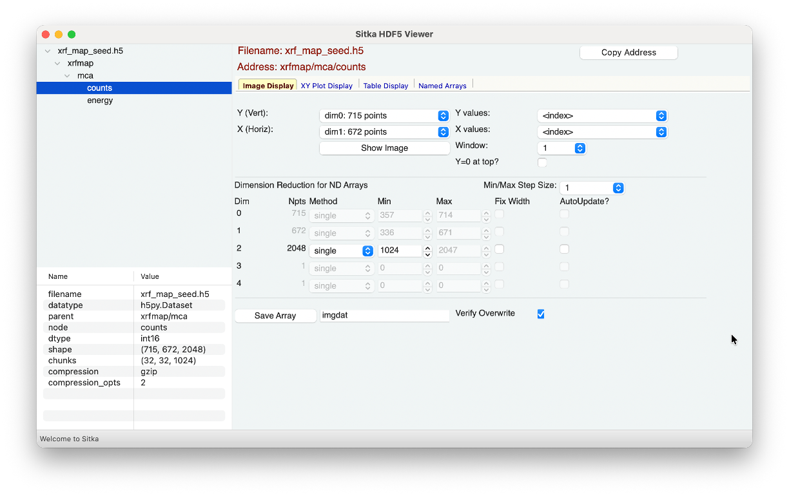
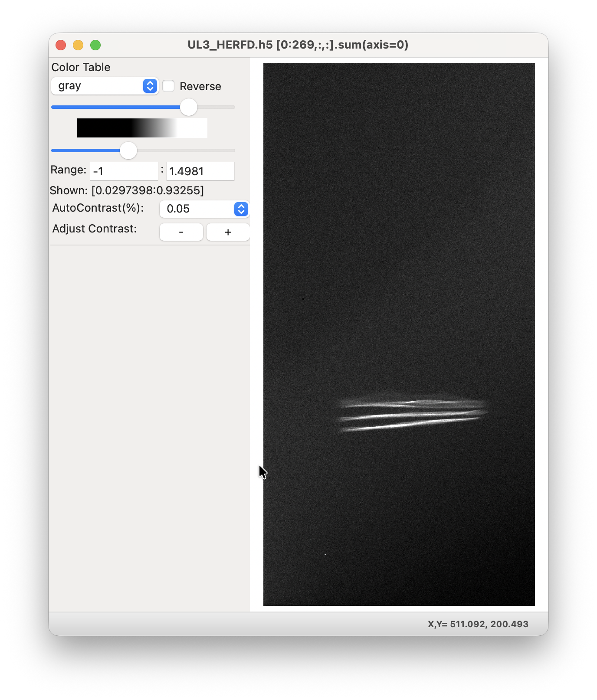
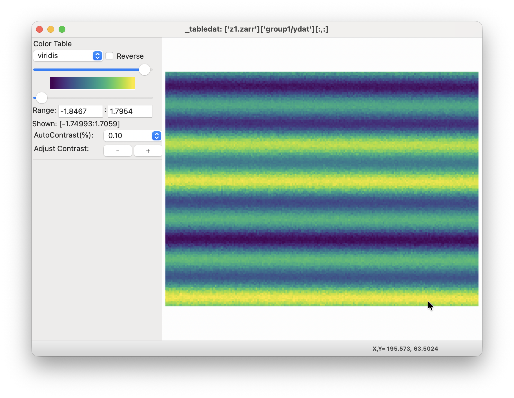

.. include:: _config.rst

.. _image_display:

The Image Display Page
====================================

The Image Display page will look like

and allow you make images or false-color maps of the multi-dimensional
data.

In the top **Array Selection** section, you can select the dimension
for Y (the vertical axis) and X (the horizontal axis). The choices for
dimensions and number of points will be automatically updated for each
dataset, following the shape values (shown in the Info section).

For data arrays that have 3- or more dimensions, changing the
selections for the Y and X dimensions will automatically change how
the contents of the **Dimension Reduction** is presented.  See
:ref:`dimreduce_panel` for information about how you can use this.

If you have named 1-D arrays of the appropriate length, these will be
included in the drop-down lists for the "Y values" or "X values", to
give dimensions to the resulting image.  By default, the array index
will be used.

To show an image for your selected arrays, but the "Show Image"
button.  You can also select the window display number to show
multiple images at a time.  Each of these will look like:

These image displays are fully interactive, and allowing zooming,
rotating, flipping, and smoothing.  Axes, grid lines, and scale bars
can be configured and shown after the image is displayed.  The image
can be copied to the system clipboard with Ctrl-C.  A wide selection
of color table can be used.  The upper and lower levels can be
adjusted by hand or by selecting or stepping through a wide dynamic
range of "percent contrasts".  For more details using this image
display, see `WXMPLOT Interactive Image Display`_

If you have saved multiple images of the same shape -- perhaps
different slices of a third dimension for a 3-d dataset -- then you
can use the "Red: ", "Green: ", and "Blue: " choices to select 2 or 3
arrays of the same shape to show as an image with each array in Red,
Green, or Blue.
