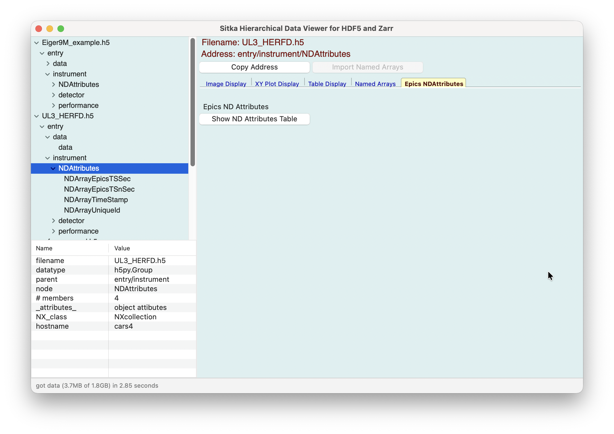
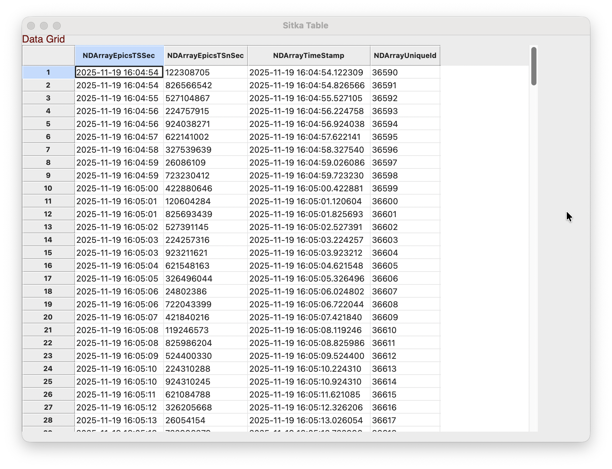
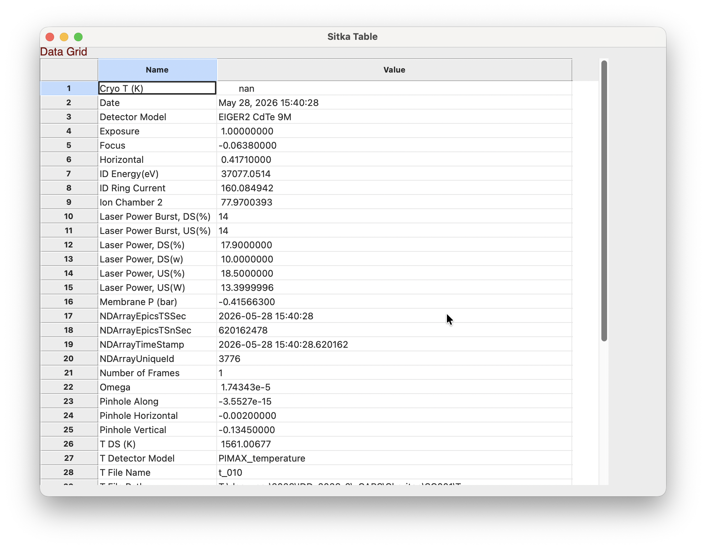

.. include:: _config.rst

.. _ndattrs_page:

Epics areaDetector NDAttributes
==========================================

For HDF5 Files saved by the Epics control system's areaDetector
software, Sitka will recognize that an HDF5 file has a Group with an
address of `entry/instrument/NDAttributes` is meant to hold meta-data
for that data acquisition.  For the many synchrotron and user
facilities using Epics and its areaDetector software, these files will
be ubiquitous.  Reading and extracting the metadata from these files
is somewhat challenging for the novice user, as long strings may be stored
as byte arrays, and times will be stored as an Epics timestamp, offset
from the standard Unix timestamp by 20 years.

If the NDAttributes is recognized in an HDF5 file, Sitka will add an
"Epics NDAttributes" Tab to the Notebook panels.

This page has only one Button to show the attributes in the Table
display.

Since the datasets in the `NDAttributes` group will be of uniform
length (one for each "image" of the data acquisition), a table will be
made containing all the datasets in this Group.  If the datasets have
multiple values, the table will have a column for each dataset, such as

Note that timestamps have been converted to ISO-standard timestamps.

If the NDattributes have only 1 value, such as with

then the values will be displayed as key/value pairs, such as

In all cases, the Table display allows the user to export the data
shown into tab-separated-value files.
