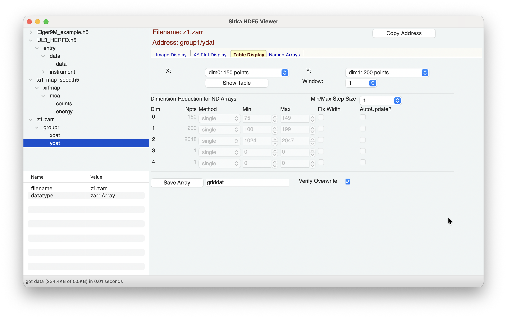
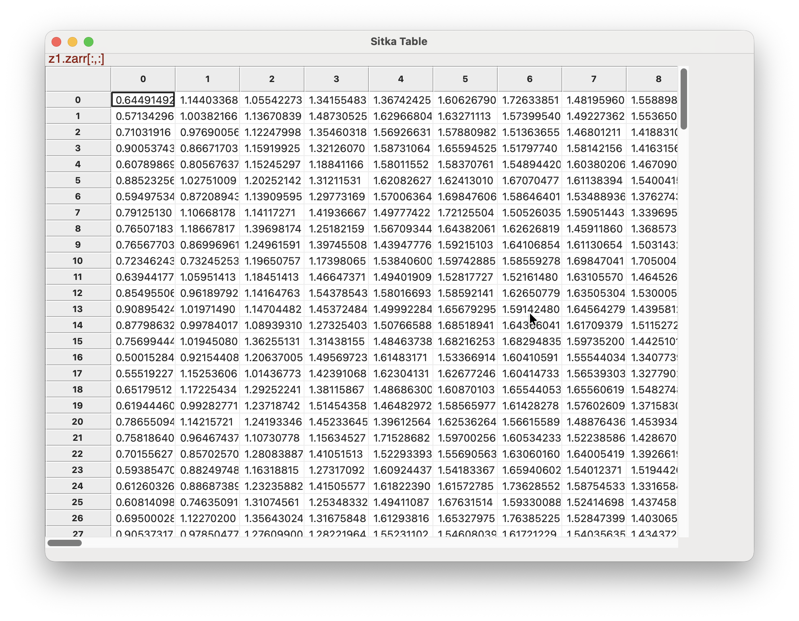

.. include:: _config.rst

.. _table_display:

The Table Display Page
====================================

The Table Display page will look like

and allow you show Grid-like tables of values for arrays.

In the top **Array Selection** section, you can select the dimension
for Y (the vertical axis) and X (the horizontal axis). The choices for
dimensions and number of points will be automatically updated for each
dataset, following the shape values (shown in the Info section).

For data arrays that have 3- or more dimensions, changing the
selections for the Y and X dimensions will automatically change how
the contents of the **Dimension Reduction** is presented.  See
:ref:`dimreduce_panel` for information about how you can use this.

