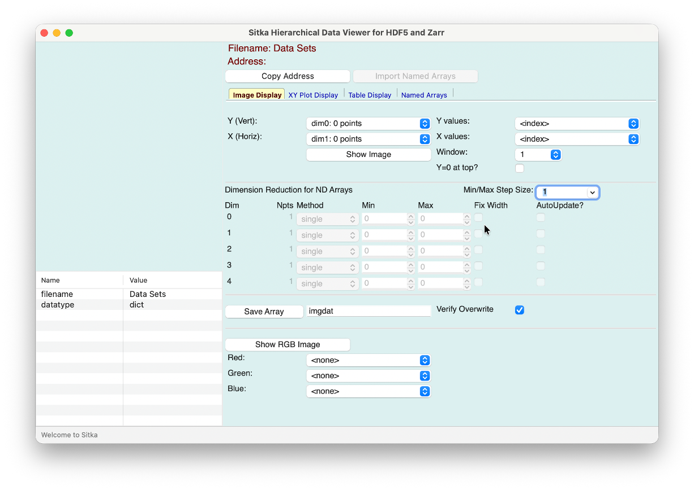
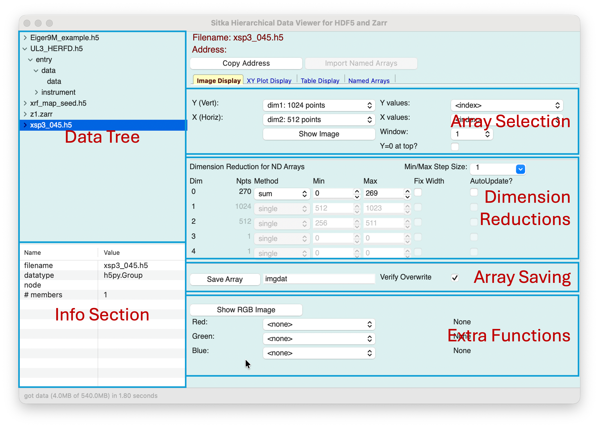
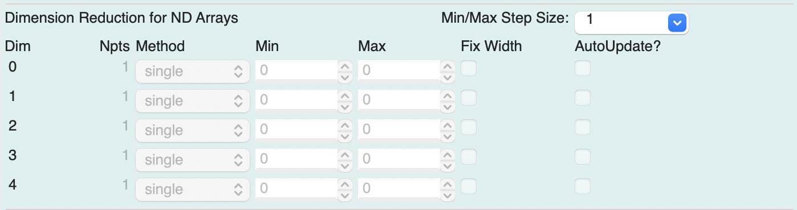

.. include:: _config.rst

Using Sitka
====================================

In this section, we'll give information for starting the Sitka GUI,
loading, and using datafiles.

Running the Sitka GUI
-----------------------------

Sitka can be used as a stand-alone GUI application or from a Python
REPL or Jupyter Notebook.

Using the command-line `sitka` program
~~~~~~~~~~~~~~~~~~~~~~~~~~~~~~~~~~~~~~~~~~~~

To run sitka from a command-line terminal, use

.. code:: bash

   sitka

You can use the '-d' option to specify a directory from which to read
datasets, as with

.. code:: bash

   sitka -d /home/User/data

Creating and Using a Desktop shortcut
~~~~~~~~~~~~~~~~~~~~~~~~~~~~~~~~~~~~~~~~

If you have created the desktop shortcut (see
:ref:`desktop_shortcut`), then clicking on that should launch the main
Sitka application.

Running Sitka from a Python shell or  Jupyter Notebook
~~~~~~~~~~~~~~~~~~~~~~~~~~~~~~~~~~~~~~~~~~~~~~~~~~~~~~

You can run the Sitka viewer from within a Python shell or Jupyter
notebook that is connected to your computer (that is, supports drawing
to your local screen) to get an interactive graphical exploration of
your data.  To do this, use:

.. code:: Python

   from sitka_spruce import sitka_viewer
   sview = sitka_viewer()

You can also optionally specify a directory
from which to read datasets with

.. code:: Python

    sview = sitka_viewer(folder='/home/User/data')

This will launch the Sitka GUI application in a Window outside of the
Python shell or Jupyter notebook.

The Sitka Viewer will allow the shell or notebook to remain active while the
viewer also runs. That is, you can load and visualize data as with the
standalone application.  You can also use the shell or notebook to
access the data in the Sitka Viewer, either adding datasets to the GUI
or pulling arrays from the GUI into the shell.

.. code:: Python

    ##
    # import an HDF5 file from the shell, and add it to the Sitka Viewer
    # this allows you to fully explore the data arrays in the file
    import h5py
    myfile = h5py.File('myhdf5_file.h5', 'r')
    sview.add_dataset('myhdf5_file.h5', myfile)

    ##
    # Sitka allows you to copy addresses and slices to the System
    # Clipboard, so you can paste them into your shell/notebook
    # Doing <Ctrl-V>  might paste
    #     ['myeiger_file.h5']['/entry/data/data'][10:20,:,:].sum(axis=0)
    # into the shell, and you can use that to access the data as
    myimage = sview.data.datasets['myeiger_file.h5']['/entry/data/data'][10:20,:,:].sum(axis=0)

    ##
    # list all datasets in the viewer, no matter how they were read
    for name, dset in sview.data.datasets.items():
        print(name, dset)

    ##
    # list all "named arrays" saved during data exploration
    for name, array in sview.data.array.items():
        print(name, array.shape)

    ##
    # take an example array and run your analysis pipeline on it
    myarray = sview.data.array['spectra1']

    from my_analysistool import analyze
    result  = analyze(myarray)

With this approach, you can quickly load and explore your datasets and
extract and use the arrays you want for downstream processing.

Basic Usage of the Sitka GUI
-------------------------------------------------------------

On Startup the Sitka GUI will look like this:

with an empty panel in the upper left.  To reading in an HDF5 file or
Zarr directory store using the File -> Read Data File or use Ctrl-O
(Option-O on MacOS).  The file name will be shown in the Data Tree
section of the Window.

.. note::

   The examples shown throughout this document can be downloaded from `SitkaExamples`_.

Overview of the main Sitka Window
~~~~~~~~~~~~~~~~~~~~~~~~~~~~~~~~~~~~~~~

The main window is broken into several sections, as shown above.  This should be
familiar to anyone who has used one of the other HDF5 viewers (see
:ref:`motivation` for a partial list).

  * A **Data Tree** in the upper left lets you browse through the
    Tree-like structure of the hierarchical datasets.
  * An **Info Section** in the lower left will show information about
    the Groups and Datasets (or Arrays), including datatype, shape,
    chunking, compression, and the list of attributes saved in the
    Group or Dataset.
  * The Right-hand panel has a notebook inferface with pages for
    **Image Display**, **XY Plot Display**, **Table Display**, and
    **Named Arrays**.  The frirst three of the pages help you select
    and display multi-dimensional arrays, and have similar forms, with
    the sections shown in the screenshot above.
  * An **Array Selection** panel in the upper section of the
    notebook page allows you to select one more dimensions of the Array
    data.
  * A **Dimension Reduction** panel in the middle section of the
    notebook page allows you to select how to "reduce" other dimensions
    of the dataset, either selecting a single element or a range of
    values to sum. See :ref:`dimreduce_panel` for more details.
  * An **Array Saving** panel at the bottom of the notebook page allows
    you give a name to the array selected, which can then be shown
    or exported later. See :ref:`save_arrays` and :ref:`copy_address`
    for details.

Plots and Table displays for selected data arrays will be shown in
separate windows.  Each of the notebook pages will be disccussed in
detail in a separate section:

  * :ref:`image_display`
  * :ref:`xyplot_display`
  * :ref:`table_display`
  * :ref:`arrays_page`

In the following sections we discuss common features for many of these
panels.

.. _save_arrays:

Saving Arrays by Name
~~~~~~~~~~~~~~~~~~~~~~~~~~~~~~~~~~~~~~~

For the Notebook Panels, the array data selected for plotting can be
saved to a named array.  In the lower panel, simply typing a name
(which must follow the valid conventions for a Python variable: A
letter or underscore followed by any number of letters, numbers, or
underscore) and hitting return or the Save Array button will save the
array.  By default, this will ask to verify overwriting an existing
array.

.. _copy_address:

Copying the Array Address
~~~~~~~~~~~~~~~~~~~~~~~~~~~~~~~~~~~~~~~

As you browse through Groups and Datasets and as you build arrays for
plotting or display, you may find data components, slices, and
addresses that you want to use for downstream processing.  Using
Ctrl-C (Option-C on macOS), or hitting the "Copy Address" button above
the Notebook pages will copy the Python syntax for the array address
to the system clipboard.  For an image display that sums over a
selected number of frames, the copied address may look like

.. code:: Python

    ['myeiger_file.h5']['/entry/data/data'][10:20,:,:].sum(axis=0)

If your are using Sitka from A Jupyter notebook or Python shell, you
may need to pre-pend the address to the Sitka datasets, as with

.. code:: Python

    myimage = sview.data.datasets['myeiger_file.h5']['/entry/data/data'][10:20,:,:].sum(axis=0)

.. _export_info:

Exporting Group/Dataset Metadata
~~~~~~~~~~~~~~~~~~~~~~~~~~~~~~~~~~~~~~~

Just as you can copy array addresses, you can also export the values
in the Info section for any Group or Dataset.  Using Ctrl-E (Option-E
on macOS) will bring up a dialog to save the data shown in the table
in the Info section to a tab-separated file.

.. _dimreduce_panel:

The Dimension Reduction Panel
~~~~~~~~~~~~~~~~~~~~~~~~~~~~~~~~~~~~~~~

The dimension reduction panel assists you in converting
multi-dimensional datasets into 1- and 2-dimensional arrays for XY
plots, image display, and table display.

This panel might looks like this:

Here, dimensions 0 and 1 must have been selected as the Y or X arrays
for image or table display.  The remaining dimension has 2048 points.
The settings here will select a **single** value, pixel 1024 out
of 2048.  The Method selection of **single** can be changed to **sum**
or **mean**, and then a Min and Max value be chosen to sum over that
slice of the array dimension.

If choosing a slice range for **sum** or **mean**, you can check the
"Fix Width" box.  With this checked, changing either the Min or Max
value (with the arrows or by typing in a number) will update both
values to try to preserve their difference.  You can change to step
taken by the arrow keys with the Min/Max Step Size selection.
Finally, if you check the "Auto Update" box, then changing the Min or
Max value will update the display to reflect the newly sliced data.

A note on speed of Array Selection
~~~~~~~~~~~~~~~~~~~~~~~~~~~~~~~~~~~~~~~

HDF5 and Zarr hold data in chunks of binary data on disk, with
optional compression.  These settings are displayed in the Info
section.

Extracting data from HDF5 and Zarr may no be instantaneous.  In
certain cases, it may even appear to be "slow".  The extraction speed
can depend greatly on the chunking and compression used, and the data
size.  We will assert that the speed of extracting data from HDF5
files is fully within the HDF5 library, and not because "Python is
slow" or "matplotlib is slow" or "wxPython is slow".  If you have
suggestions for speeding up data extraction or display, we'll be happy
to hear them.
