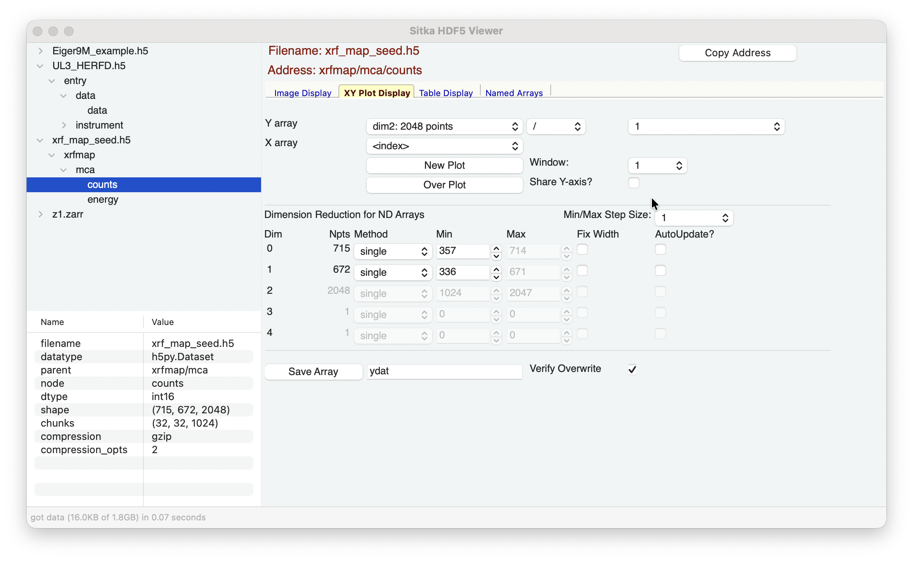
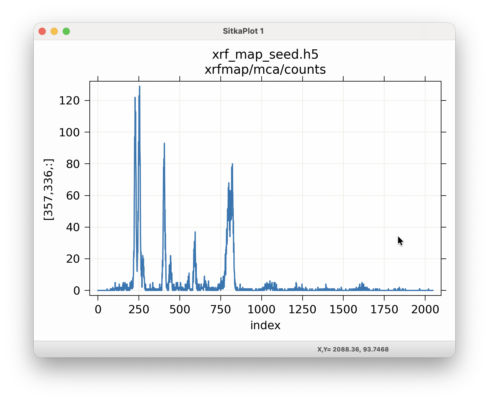

.. include:: _config.rst

.. _xyplot_display:

The XY Plot Display Page
====================================

The XY Plot Display page will look like

and allow you make images or false-color maps of the multi-dimensional
data.

In the top **Array Selection** section, you can select the dimension
for Y Array data.

The choices for dimensions and number of points will be automatically
updated for each dataset, following the shape values (shown in the
Info section).

For data arrays that have 2- or more dimensions, changing the
selections for the Y Array will automatically change how the contents
of the **Dimension Reduction** is presented.  See
:ref:`dimreduce_panel` for information about how you can use this.

If you have named 1-D arrays of the same length as the Y array data,
these will be included in the drop-down lists for the "Normalization
Array" and the "X Array".  The Normalization Array (defaulting to the
constant "1") can be used to multiply, divide, add, or subtract from
the selected Y array.  The choice for the X Array will be used for the
X-axis of the plot, defaulting to the array index.

To show the plot for your selected arrays, you can either use "New
Plot" to show in a new plot window (and you can select up to 10 of
these), or you can use "Over Plot" to plot with the existing XY Plot.
The checkbox for "Share Y axis" will control whether the Y-scale for
multiple plot traces should be shared or independent.

As with the image displays, thes plots are fully interactive, and
allowing zooming, panning.  The plots can be configured and can be
copied to the system clipboard with Ctrl-C.  A wide selection of color
themes are available, and colors, linetypes, text, and sizes for most
elements can be changed after displayed.  For more details using this
image display, see `WXMPLOT Interactive Plot Display`_
